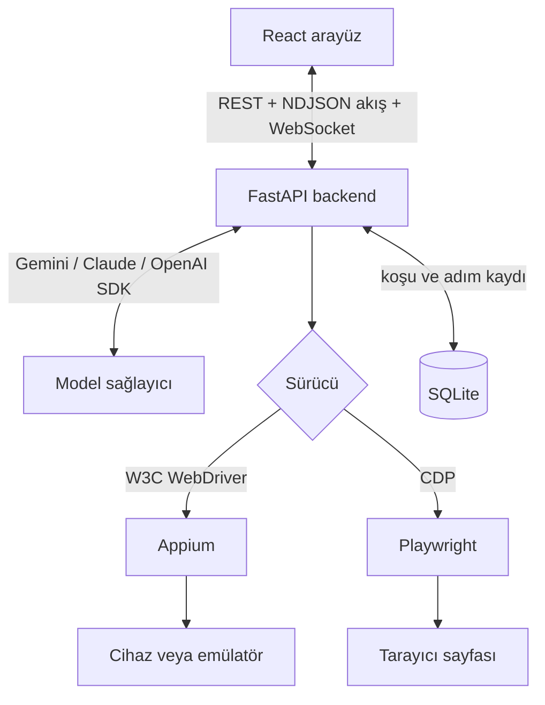

# QAi — AI QA Agent & Inspector

QAi, **bağlı bir Android/iOS cihazını ya da bir web sayfasını** yapay zeka ile süren bir test otomasyon aracıdır. Bir test senaryosunu düz metin olarak yazarsınız; QAi ekranı okur, adım adım karar verir, aksiyonları gerçek hedefte çalıştırır, sonucu **doğrular (assertion)** ve koşuyu ekran görüntüleriyle birlikte kaydeder. Koşu bittiğinde tek tıkla çalıştırılabilir bir script olarak dışa aktarabilirsiniz.

FastAPI backend + React (Vite) frontend. Koyu/açık tema desteği vardır.

---

## Mimari



**Aynı döngü, iki hedef.** Agent döngüsü hedefin ne olduğunu bilmez — [`drivers/base.py`](backend/drivers/base.py) dört şey tanımlar: ekranı oku, ekran görüntüsü al, elementi bul ve üstünde aksiyon yap. `MobileTarget` bunu Appium ile, `WebTarget` Playwright ile karşılar. Locator, kayıt, rapor ve export katmanlarının hiçbiri değişmez.

### Otonom test döngüsü

Döngü **backend'de** çalışır ([`agent.py`](backend/agent.py)). Tarayıcıda değil — böylece adım tavanı, iptal sinyali, adım kaydı ve assertion kararı tek bir yerde toplanır. Arayüz sadece gelen olay akışını çizer.

1. **Ekranı oku.** Appium'un XML hiyerarşisi [`mobile_dom.py`](backend/mobile_dom.py) ile sadeleştirilir: Android ve iOS sınıfları ortak semantik rollere (`button`, `textbox`, `text`, `image`, `switch`) eşlenir, bilgi taşımayan container'lar düzleştirilir, her düğüme `el_0`, `el_1`… kimliği verilir. Her anlık görüntünün kendi `snapshot_id`'si vardır.
2. **Modele sor.** Ekran ağacı JSON olarak, **ve isteğe bağlı olarak ekran görüntüsü** seçili sağlayıcıya gönderilir — **Gemini, Claude veya ChatGPT**, her biri kendi resmi SDK'sı üzerinden ([`llm/`](backend/llm/)). Görüntü, DOM'da görünmeyen ikon-only butonları ve custom-drawn arayüzleri çözer. Model tek bir aksiyon döndürür.
3. **Aksiyonu çalıştır.** [`locator.py`](backend/locator.py) elementi bulur: semantik benzerlik skorlaması, otomatik bekleme, viewport dışındaysa otomatik kaydırma, W3C etkileşim, olmazsa koordinat fallback'i. İki aday eşit derecede iyi eşleşirse **hata verir** — sessizce birini seçmez.
4. **Kaydet ve devam et.** Adım, mesajı, hedef elementi, süresi ve sonrasındaki ekran görüntüsüyle SQLite'a yazılır. Döngü `done` aksiyonuna, bir assertion başarısızlığına, adım tavanına veya iptale kadar sürer.

### Agent aksiyonları

| Aksiyon | Açıklama |
|---|---|
| `click`, `type`, `clear` | Element hedefli etkileşimler |
| `scroll`, `swipe` | `up` / `down` / `left` / `right` |
| `key` | `back`, `home`, `recents`, `enter`, `search`, `delete` |
| `wait` | Saniye (en fazla 10) |
| `assert_visible` | Element ekranda ve etkileşilebilir mi |
| `assert_text` | Metin ekranda mı — başarısızsa görünen metinleri listeler |
| `done` | `pass` / `fail` ile koşuyu bitirir |

**Assertion içermeyen bir koşu test değildir.** Sistem promptu modeli bitirmeden önce doğrulama yapmaya zorlar; başarısız bir assertion koşuyu anında `failed` yapar.

---

## Öne çıkan özellikler

* **İki hedef, tek agent** — Cihaz veya web sayfası. Studio'da sekme değiştirip bir URL yazmanız yeterli; senaryo yazma biçimi, assertion'lar, rapor ve replay aynı.
* **Sağlayıcı seçimi** — Gemini, Claude veya ChatGPT. Arayüzden seçilir, anahtar girilir, test edilir. Model alanı serbest metindir: anahtarınızın eriştiği herhangi bir model id'si çalışır.
* **Otonom agent** — Adım tavanı, canlı ilerleme göstergesi ve gerçekten çalışan bir **Stop** butonu ile.
* **Test koşu geçmişi ve raporu** — Her adım, süresi, mesajı ve ekran görüntüsüyle kalıcı olarak saklanır.
* **Script export** — Cihaz koşuları `pytest` + Appium-Python-Client / WebdriverIO / Gherkin; web koşuları **Playwright (Python veya TypeScript)** / Gherkin. Arayüz sadece o koşunun hedefine uyan formatları gösterir, üretilen Python'un gerçekten derlendiği testle doğrulanır.
* **Deterministik replay** — Kayıtlı bir koşuyu modele hiç sormadan yeniden çalıştırır. Hızlı ve ücretsiz.
* **Kendini onaran replay** — Sayfa değişip seçici tutmazsa koşu ölmez: önce aynı element semantik olarak yeniden eşleştirilir (bedava), o da olmazsa model devreye girer. Onarılan adımlar raporda işaretlenir.
* **Süitler ve CI** — Cases etiketle seçilir, dataset'i olan bir case her satır için bir kez koşar, her koşu kendi izole tarayıcısını alır. `cli.py` JUnit XML ve JSON raporu yazar, çıkış kodu bir build sunucusunun beklediği anlama gelir.
* **Insights** — Bir süitin geçmişi iki soruya cevap verir: gidişat iyiye mi gidiyor, ve hangi case'lere güvenilemez (flaky).
* **Keşif taraması** — Model çağrısı olmadan sayfadaki her etkileşimli elemente tıklar ve ne olduğunu raporlar: `navigated`, `dialog`, `changed`, `request` ya da asıl işe yarayanı — `dead`.
* **Görsel regresyon** — Ekran görüntüsünü kayıtlı bir baseline ile karşılaştırır. `threshold` antialiasing gürültüsünü, `tolerance` yanıp sönen imleci soğurur.
* **Senaryo önerileri** — Boş prompt kutusu yerine, ekranda gerçekten ne varsa ona göre öneri: arama kutusu olan sayfa arama önerisi, giriş formu olan sayfa yanlış-parola önerisi alır. Model çağrısı yok.
* **Kayıtlı oturum profilleri** — Bir kez giriş yapıp profili saklarsınız; sonraki koşular o oturumdan başlar.
* **Element Inspector** — Filtrelenebilir DOM ağacı, rol renklendirmesi, xpath/id kopyalama, cihaz ekranında canlı overlay, ve ekranda bir noktaya tıklayarak element seçme.
* **Manuel kontrol** — Ayna üzerinde tap / uzun basma / kaydırma / swipe, donanım tuşları, klavye girişi.
* **WebSocket ekran akışı** — Görüntü değişmediyse kare gönderilmez. HTTP polling fallback'i vardır.
* **Çoklu cihaz** — Aynı anda birden fazla oturum açık tutulabilir.
* **Uygulama seçimi** — Oturum açarken cihazdaki üçüncü parti uygulamalar listelenir.
* **Emülatör ve simülatör desteği** — `adb` ve `xcrun simctl` üzerinden otomatik algılanır.

---

## Gereksinimler

* **Node.js** 18+
* **Python** 3.10+
* **Appium 2.x**, global kurulu:
  ```bash
  npm install -g appium
  appium driver install uiautomator2   # Android
  appium driver install xcuitest       # iOS (macOS)
  ```
* **Android:** Android SDK platform-tools (`adb` PATH'te olmalı)
* **iOS (macOS):** Xcode Command Line Tools ve `brew install libimobiledevice`

---

## Kurulum

### Backend

```bash
cd backend

# Windows
python -m venv .venv
.venv\Scripts\activate

# macOS / Linux
python3 -m venv .venv
source .venv/bin/activate

pip install -r requirements.txt
python -m playwright install chromium   # web hedefi için, bir kez
cp .env.example .env      # Windows: copy .env.example .env
```

`.env` dosyasına Gemini anahtarınızı yazın. **Bu dosya `backend/` içinde olmalı** — QAi onu mutlak yolla okur, yani sunucuyu hangi dizinden başlattığınız fark etmez.

### Frontend

```bash
cd frontend
npm install
```

---

## Çalıştırma

İki terminal:

```bash
# 1
cd backend && python main.py          # http://127.0.0.1:8000  (/docs API dökümanı)

# 2
cd frontend && npm run dev            # http://localhost:5173
```

Sonra arayüzde:

1. **Settings** → **Model provider** kartından Gemini / Claude / ChatGPT'den birini seçin, API anahtarını girin, *Test connection* ile doğrulayıp kaydedin. Anahtarlar sağlayıcı başına saklanır — sonradan aralarında geçiş yaparken yeniden yazmanız gerekmez.
2. **Settings** → *Start server* ile Appium'u başlatın; canlı log alt panelde akar.
3. Hedefi seçin — kenar çubuğundaki iki sekme:
   * **Web** — bir adres yazın (`turkishairlines.com`), viewport seçin, *Open* deyin. Appium gerekmez.
   * **Mobile** — cihazınızı tarayın, isterseniz hedef uygulamayı seçin, *Connect* deyin. (Appium gerekir.)
4. Senaryonuzu yazın (Türkçe veya İngilizce) ve gönderin.
5. **Test Runs** → koşu raporunu inceleyin, scripti indirin veya replay edin.
6. **Suites** → tekrar eden koşuları süit hâline getirin; **Insights** → gidişatı ve flaky case'leri görün.

---

## CI'dan çalıştırma

Arayüz bir pull request'i geçirip bırakamaz; `cli.py` bunun için var. İstem sormaz, varsayılan olarak tarayıcı penceresi açmaz, makine okuyabilen rapor yazar ve çıkış kodu bir build sunucusunun beklediği anlama gelir.

```bash
cd backend
python -m cli suites                       # süitleri listele
python -m cli run --suite <id> --tag smoke --workers 4 \
    --junit results.xml --json report.json
```

| Çıkış kodu | Anlamı |
|---|---|
| `0` | Her case geçti |
| `1` | En az bir case başarısız |
| `2` | Koşu başlayamadı (hatalı argüman, olmayan süit, eksik API anahtarı) |

JUnit XML'i Jenkins, GitHub Actions, GitLab ve TeamCity eklentisiz okur. JSON raporu ise JUnit'e sığmayan her şeyi taşır: onarılan adımlar, sayfa hataları, artifact'lar, görsel diff'ler.

Diğer alt komutlar: `cases`, `create-suite`, `add-case`, `report` (biten bir süit koşusunun raporunu yeniden üret), `flaky` (fikir değiştiren case'ler). Hepsi için `--help` var.

---

## Testler

```bash
cd backend && pytest        # 288 test
cd frontend && npm run lint && npm run build
```

---

## Yapılandırma

Hepsi `backend/.env` üzerinden ([`config.py`](backend/config.py)):

| Değişken | Varsayılan | Ne işe yarar |
|---|---|---|
| `LLM_PROVIDER` | `gemini` | `gemini` \| `claude` \| `openai` |
| `LLM_MODEL` | Sağlayıcının varsayılanı | Anahtarınızın erişebildiği herhangi bir model id'si. |
| `GEMINI_API_KEY` | — | Sadece kullandığınız sağlayıcı(lar) için gerekli. |
| `ANTHROPIC_API_KEY` | — | Anahtarlar sağlayıcı başına saklanır; geçiş yapmak diğerlerini silmez. |
| `OPENAI_API_KEY` | — | |
| `APPIUM_HOST` | `http://localhost:4723` | Appium başka porttaysa. |
| `MAX_AGENT_STEPS` | `40` | Sunucu tarafı mutlak adım tavanı. |
| `ALLOWED_ORIGINS` | Vite portları | CORS. Wildcard **kullanmayın** — herhangi bir web sitesi telefonunuzu sürebilir hale gelir. |

Frontend `VITE_API_BASE` ile backend adresini değiştirebilir (varsayılan `http://localhost:8000`).

---

## Modüller

| Dosya | Sorumluluk |
|---|---|
| [`config.py`](backend/config.py) | Ortam değişkenleri, mutlak yollar |
| [`appium_client.py`](backend/appium_client.py) | Async Appium/W3C REST istemcisi |
| [`process_manager.py`](backend/process_manager.py) | Platform bağımsız Appium süreç yönetimi |
| [`devices.py`](backend/devices.py) | `adb` / `libimobiledevice` cihaz keşfi |
| [`mobile_dom.py`](backend/mobile_dom.py) | Appium XML → semantik element ağacı |
| [`web_dom.py`](backend/web_dom.py) | Canlı DOM → aynı ağaç şekli (agresif filtreleme) |
| [`drivers/`](backend/drivers/) | `MobileTarget` (Appium) ve `WebTarget` (Playwright), tek arayüz |
| [`locator.py`](backend/locator.py) | Auto-wait, semantik eşleştirme, snapshot yönetimi |
| [`gesture_controller.py`](backend/gesture_controller.py) | Dokunma ve tuş olayları |
| [`agent.py`](backend/agent.py) | Otonom döngü |
| [`llm/`](backend/llm/) | Sağlayıcılar: Gemini, Claude, OpenAI — her biri kendi resmi SDK'sıyla |
| [`storage.py`](backend/storage.py) | Koşu ve adım kalıcılığı |
| [`exporters.py`](backend/exporters.py) | Koşu → çalıştırılabilir script |
| [`suite_runner.py`](backend/suite_runner.py) | Süit koşusu: etikete göre seçim, dataset satırı başına koşu, sınırlı paralellik |
| [`healing.py`](backend/healing.py) | Kendini onaran replay: önce kayıtlı seçici, sonra semantik eşleşme, en son model |
| [`explorer.py`](backend/explorer.py) | Keşif taraması: her şeye tıkla, neyin gerçekten bir şey yaptığını raporla |
| [`visual.py`](backend/visual.py) | Görsel regresyon: ekran görüntüsünü baseline ile karşılaştır |
| [`suggestions.py`](backend/suggestions.py) | Ekrandaki elementlerden türetilen senaryo önerileri (model çağrısı yok) |
| [`reporters.py`](backend/reporters.py) | Koşu → JUnit XML ve ayrıntılı JSON raporu |
| [`cli.py`](backend/cli.py) | CI'ın çağırdığı komut satırı girişi |

---

## Sorun giderme

### Cihaz görünmüyor
* **Android:** `adb devices` çıktısında `unauthorized` görünüyorsa telefondaki USB hata ayıklama iznini iptal edip yeniden onaylayın, ardından `adb kill-server && adb start-server`.
* **iOS:** *Ayarlar → Gizlilik ve Güvenlik → Geliştirici Modu*'nu açın ve "Bu bilgisayara güven" uyarısını onaylayın.

### Intel Mac'te `pip install` derlemeye düşüyor

`cryptography` 49.0.0'dan itibaren macOS için yalnızca arm64 wheel yayınlıyor. Intel bir Mac'te pip kaynaktan derlemeye çalışır ve Rust toolchain yoksa patlar. `requirements.txt` bu platformda sürümü 48.x'e sabitler, yani normalde bununla karşılaşmazsınız — ama paketi elle güncellerseniz geri gelir.

Ayrıca `.venv` taşınabilir değildir: başka bir makinede (özellikle Windows'ta) oluşturulmuş bir sanal ortam macOS'ta çalışmaz, çünkü `pyvenv.cfg` mutlak yollar tutar. Böyle bir durumda `.venv`'i silip yeniden oluşturun.

### Appium başlamıyor
`npm install -g appium` ile global kurulu olduğundan emin olun. Backend `appium`, `appium.cmd` ve `appium.ps1` adlarını PATH'te arar. Ayrıntılı hata Settings'teki log panelinde görünür.

### Port 4723 kullanımda
* **Windows:** `netstat -ano | findstr 4723` sonra `taskkill /F /PID <PID>`
* **macOS / Linux:** `kill -9 $(lsof -t -i:4723)`

### iOS "WDA / Code 65"
Xcode'da `WebDriverAgent.xcodeproj` dosyasını açıp *Signing & Capabilities* sekmesinden kendi hesabınızla (ücretsiz Personal Team yeterli) imzalayın.

### Web sayfası açılmıyor
`python -m playwright install chromium` komutunu bir kez çalıştırdığınızdan emin olun. Sayfa geç yükleniyorsa QAi `domcontentloaded` bekleyip networkidle için en fazla 6 saniye daha bekler; ağır SPA'larda ilk snapshot eksik gelirse Inspector'da *Reload* deyin.

### Web koşusunda agent yanlış şeye tıklıyor
Sayfanın **sadece üst kısmı** ağaca girer (viewport + bir ekran altı). Aradığı şey aşağıdaysa agent'ın önce `scroll` yapması gerekir; system prompt bunu söyler. Çerez banner'ları tıklamaları yakalar — senaryonuza "önce çerez uyarısını kapat" eklemek koşuyu belirgin biçimde kısaltır.

### Agent "Ambiguous target" diyor
Ekranda birbirinden ayırt edilemeyen birden fazla element var (örneğin aynı metinli liste satırları). Bu kasıtlı: QAi rastgele birini seçmek yerine size söyler. Senaryonuzu ayırt edici bir metin veya id ile netleştirin.

---

## Lisans

MIT. Ayrıntılar için `LICENSE` dosyasına bakın.
