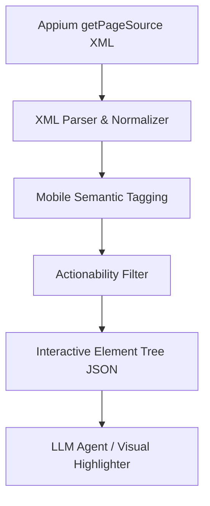

# Playwright DOM ve Mobil Cihaz Hiyerarşisi Yönetimi

Bu doküman, Playwright'ın web sayfalarındaki gelişmiş DOM yönetim yaklaşımlarını, element konumlandırma, aksiyon alabilirlik (actionability) ve otomatik bekleme (auto-waiting) mekanizmalarını incelemekte ve bu prensipleri mobil cihazların UI kaynak ağacına (UI XML Hierarchy) uyarlamak için kurulacak mimariyi planlamaktadır.

---

## 1. Playwright DOM Yönetim Prensipleri

Playwright, geleneksel Selenium tabanlı otomasyon araçlarının aksine, tarayıcıyla doğrudan (CDP - Chrome DevTools Protocol veya benzeri düşük seviyeli kanallar üzerinden) çift yönlü iletişim kurar. Bu sayede DOM üzerinde son derece kararlı ve hızlı işlemler gerçekleştirebilir.

### A. Konumlandırma Stratejisi (Locator Strategy & Semantic Selectors)
Playwright, kırılgan olan XPath veya CSS seçicileri yerine **Erişilebilirlik (Accessibility - ARIA) ağacına** dayalı ve kullanıcı odaklı semantik konumlandırıcıları (Locators) önceliklendirir:
- `page.getByRole(role, { name })`: Elementin semantik rolüne (buton, girdi alanı, başlık vb.) ve ismine göre seçer.
- `page.getByText(text)`: Ekranda görünen metne göre seçer.
- `page.getByLabel(label)`: Form elemanıyla ilişkili etikete göre seçer.
- `page.getByPlaceholder(placeholder)`: Girdi alanının placeholder metnine göre seçer.
- `page.getByTestId(testId)`: Test için özel eklenmiş niteliklere (`data-testid`) göre seçer.

**Avantajı:** Arayüzün tasarımı veya CSS sınıfları değişse bile, semantik yapı genellikle korunduğu için test senaryoları kırılganlıktan uzak ve sürdürülebilir olur.

### B. Aksiyon Alabilirlik Kontrolleri (Actionability Checks)
Playwright, bir elementle etkileşime girmeden (tıklama, yazma vb.) önce elementin o aksiyona hazır olduğundan emin olmak için şu kontrolleri otomatik olarak gerçekleştirir:
1. **Attached:** Elementin DOM ağacına eklenmiş olması.
2. **Visible:** Elementin ekranda görünür olması (`display: none` veya `visibility: hidden` olmaması, boyutlarının sıfırdan büyük olması).
3. **Stable:** Elementin animasyon halinde olmaması (pozisyon veya boyut değişiminin durmuş olması).
4. **Enabled:** Elementin devre dışı (`disabled`) olmaması.
5. **Receives Events:** Elementin üstünde, tıklanmasını engelleyen başka bir katman (overlay, modal vb.) olmaması.

### C. Otomatik Bekleme (Auto-Waiting)
Yukarıdaki aksiyon alabilirlik kontrolleri başarısız olursa, Playwright hata fırlatmak yerine belirtilen zaman aşımı (timeout) süresince elementi otomatik olarak bekler. Element hazır olduğu anda aksiyon icra edilir.

### D. LLM Ajanları İçin DOM Optimizasyonu (DOM Serialization)
Playwright tabanlı modern AI ajanları (örneğin WebArena vb.), LLM'e tüm HTML'i göndermek yerine DOM ağacını optimize ederler:
- Sadece etkileşimli elementler (butonlar, linkler, inputlar) ve onların semantik anlamları (role, label, text) filtrelenir.
- Her elemente benzersiz, geçici bir ID (`[12] Button "Submit"`) verilir.
- LLM'in koordinat bazlı tıklama yapabilmesi veya görsel olarak işaretleyebilmesi için elementlerin ekran koordinatları (`Bounding Box`) hesaplanır.

---

## 2. Mobil Cihazlar İçin "Playwright-Like" DOM Yönetim Mimarisi

Mobil otomasyonda (Appium/UiAutomator2/XCUITest) elimizde HTML DOM yerine **XML UI Hiyerarşisi** bulunur. Bu yapıyı Playwright benzeri akıllı bir mimariye kavuşturmak için kuracağımız yapıyı aşağıda planladık.



### A. Mobil Semantik Konumlandırıcılar (Mobile Semantic Locators)
Android ve iOS'in kendine özgü sınıf isimlerini (Class Names) ve niteliklerini (Attributes) ortak bir semantik dile dönüştüreceğiz.

| Semantik Rol (Playwright Eşdeğeri) | Android Karşılığı (UiAutomator2) | iOS Karşılığı (XCUITest) |
| :--- | :--- | :--- |
| **`button`** | `android.widget.Button`, `*ImageButton`, `clickable=true` | `XCUIElementTypeButton` |
| **`textbox`** | `android.widget.EditText` | `XCUIElementTypeTextField`, `XCUIElementTypeSecureTextField` |
| **`checkbox`** | `android.widget.CheckBox` | `XCUIElementTypeCheckBox` |
| **`switch`** | `android.widget.Switch`, `android.widget.ToggleButton` | `XCUIElementTypeSwitch` |
| **`text`** / **`label`** | `android.widget.TextView` | `XCUIElementTypeStaticText` |
| **`scrollview`** | `android.widget.ScrollView`, `*RecyclerView` | `XCUIElementTypeScrollView`, `XCUIElementTypeTable` |

#### Mobil Locator Metotları:
1. `getByRole(role, { name })`: Sınıf tipini semantik role çevirip, `text` veya `content-desc` (iOS'te `label`/`name`) ile eşleştirir.
2. `getByAccessibilityId(id)`: Android'de `content-desc`, iOS'te `accessibility-id` niteliklerini hedefler.
3. `getByText(text)`: Ekranda doğrudan yazan metne göre filtreler.
4. `getByTestId(id)`: Android'de `resource-id` (sadece id kısmı), iOS'te test için eklenmiş identifier'ı hedefler.

### B. Mobil Aksiyon Alabilirlik Boru Hattı (Mobile Actionability Pipeline)
Mobil etkileşimlerin stabil olması için tıklama/yazma öncesinde şu kontrolleri gerçekleştireceğiz:
1. **Görünürlük Kontrolü (Visibility):** `displayed == "true"` ve bounds değerlerinin geçerli olması.
2. **Ekran Sınırları Kontrolü (Viewport Constraint):** Elementin sol-üst ve sağ-alt koordinatlarının cihazın aktif ekran genişlik ve yükseklik sınırları içinde (`[0,0]` ile `[screenWidth, screenHeight]`) olduğunun doğrulanması.
3. **Etkileşim Kontrolü (Interactivity):** Elementin `enabled == "true"` ve `clickable == "true"` (veya semantik olarak tıklanabilir bir sınıfa ait) olması.

### C. Otomatik Kaydırma ve Hizalama (Auto-Scroll into View)
Playwright, ekran dışında kalan bir elemente tıklanmak istendiğinde sayfayı otomatik olarak kaydırır. Mobil cihazlarda bunu simüle etmek için:
- Eğer hedeflenen elementin koordinatları viewport dışında kalıyorsa (örneğin ekranın altında veya üstünde), sistem **otomatik olarak kaydırma (Swipe/Scroll) aksiyonu** üretecektir.
- Kaydırma sonrasında XML hiyerarşisi yeniden çekilerek koordinatlar güncellenecek ve tıklama o şekilde gerçekleştirilecektir.

### D. Yapay Zeka İçin Optimize Edilmiş DOM/XML Serileştirme
FastAPI backend sunucumuzda `optimize_appium_source` metodunu geliştirerek Playwright'ın LLM optimizasyon mantığını uygulayacağız:
- **Ağaç Düzleştirme (Flattening):** Boş konteynerler (hiçbir bilgi içermeyen ve sadece tek bir alt elementi olan `FrameLayout`, `LinearLayout` vb.) elenerek hiyerarşi basitleştirilecek.
- **Kompakt JSON Temsili:** AI'a gereksiz nitelikler (örn: `focusable`, `selected`, `password`, `long-clickable` vb.) gönderilmeyerek token tasarrufu sağlanacak.
- **Benzersiz Sıralı ID'ler:** Her anlamlı elemente `el_0`, `el_1` gibi kısa kimlikler atanacak ve bu kimlikler frontend tarafında ekran üzerinde bounding box ile görsel olarak çizilebilecek.

---

## 3. Sistem Mimarisi ve Sınıf Yapısı Tasarımı

Mobil cihazlar için "Playwright benzeri" akıllı yapıyı kurmak adına backend (`backend/main.py`) ve yardımcı kütüphaneler için önerilen yapısal tasarım:

```python
class MobileElement:
    def __init__(self, raw_node, platform):
        self.platform = platform
        self.element_id = None  # el_0, el_1...
        self.role = self._resolve_role(raw_node)
        self.text = raw_node.attrib.get("text") or raw_node.attrib.get("label")
        self.name = raw_node.attrib.get("name") or raw_node.attrib.get("content-desc")
        self.resource_id = raw_node.attrib.get("resource-id")
        self.bounds = self._parse_bounds(raw_node)
        self.xpath = ""

    def _resolve_role(self, node):
        # Class ismini semantik bir role dönüştürür (button, input, vb.)
        pass

    def _parse_bounds(self, node):
        # "[x1,y1][x2,y2]" formatını ayrıştırır ve koordinat objesi döndürür
        pass

    def is_actionable(self, screen_width, screen_height):
        # Görünürlük, aktiflik ve ekran sınırları içinde olma kontrollerini yapar
        pass
```

```python
class MobileDOMManager:
    def __init__(self, xml_source, platform, screen_dimensions):
        self.platform = platform
        self.screen_width = screen_dimensions["width"]
        self.screen_height = screen_dimensions["height"]
        self.elements = []
        self.optimized_tree = self.parse_and_optimize(xml_source)

    def parse_and_optimize(self, xml_source):
        # XML parse edilir, MobileElement listesi ve sadeleştirilmiş JSON hiyerarşisi çıkarılır
        pass

    def get_by_role(self, role, name=None):
        # Playwright getByRole taklidi arama mekanizması
        pass

    def get_by_text(self, text):
        # Metne göre element bulur
        pass
```

Bu yapı sayesinde mobil otomasyon ajanımız, klasik ve kırılgan XPath yöntemlerinden tamamen sıyrılarak, Playwright kadar kararlı, hata payı düşük ve esnek bir etkileşim motoruna sahip olacaktır.
